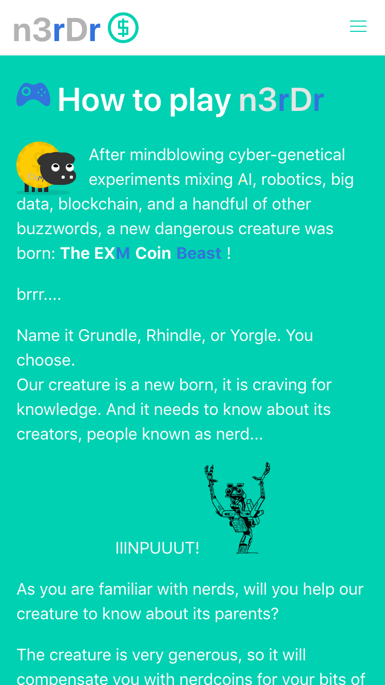

# n3rdr

A PWA UI for a quiz game, made with Vue, Bulma, CSS animations, and a bit of arcade graphics. 


## Screenshots





## Project setup
```
npm install
```

### Dev server
Start the app on a local web server:

```
npm run serve
```

Data from proxied .json mock files in `public/mock`.
If game is expired, change the `deadLine` property inside `mock/game.json`
See `vue.config.js` file.


### Compiles and minifies for production
Build for production:

```
npm run build
```
